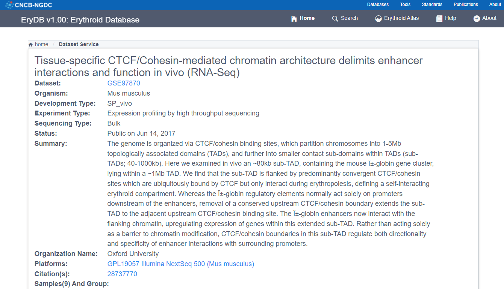
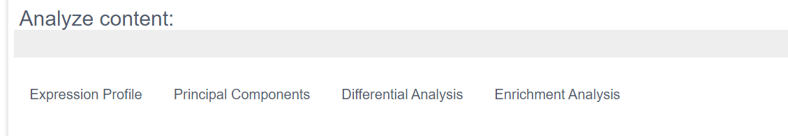
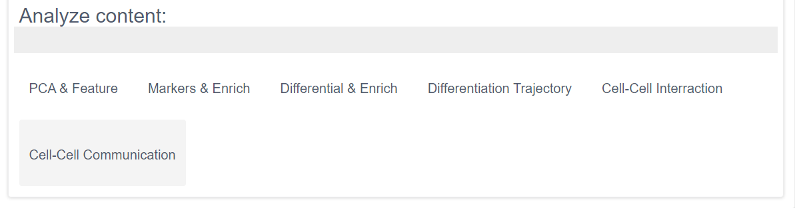

## How to start?

If you have any questions when using EryDB database, there is a manual for you:

1) Home module: four way to get the information about all datasets in EryDB;

1. By the cell type
2. By the reported gene
3. By the compound name
4. By the disease type

No mater what way you choose, you will get a full  of information about datasets as following.

  Click each row, you will get the detail information about your clicking one.

Each dataset provides analysis of function.

If this dataset's sequence type is bulk, it will have following analysis.

otherwise, there will be

